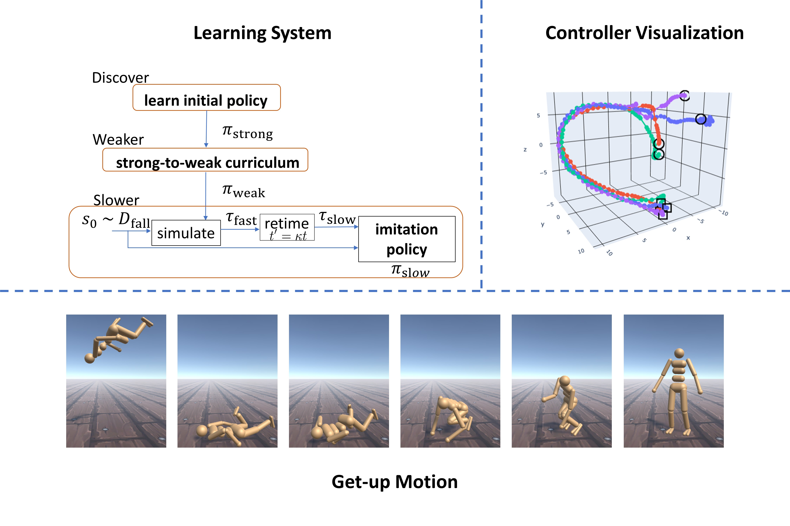

# Learning to Get Up

This repository contains code for the SIGGRAPH 2022 paper ***Learning to Get Up***. <br /> 


### Abstract:
Getting up from an arbitrary fallen state is a basic human skill. Existing methods for learning this skill often generate highly dynamic and erratic get-up motions, which do not resemble human get-up strategies, or are based on tracking recorded human get-up motions. In this paper, we present a staged approach using reinforcement learning, without recourse to motion capture data. The method first takes advantage of a strong character model, which facilitates the discovery of solution modes. A second stage then learns to adapt the control policy to work with progressively weaker versions of the character. Finally, a third stage learns control policies that can reproduce the weaker get-up motions at much slower speeds. We show that across multiple runs, the method can discover a diverse variety of get-up strategies, and execute them at a variety of speeds. The results usually produce policies that use a final stand-up strategy that is common to the recovery motions seen from all initial states. However, we also find policies for which different strategies are seen for prone and supine initial fallen states. The learned get-up control strategies have significant static stability, i.e., they can be paused at a variety of points during the get-up motion. We further test our method on novel constrained scenarios, such as having a leg and an arm in a cast.

---

## Usage of the code

### Install the dependencies
To install the python dependencies, you can create a new virtual environment than install the necessary packages:

```python
python3 -m venv python_env
source python_env/bin/activate
pip install --upgrade pip
pip install -r requirements.txt
```

This setup is tested on *Ubuntu 18.04* with *Python 3.8*


---
### Test

There is a pretrained model saved under `experiments/pretrained_model`

To reproduce the results shown in the paper, you can run the following command:
```python
python3 test.py --load_dir experiments/pretrained_model --target_style proud --input_motion data/xia_test/neutral_01_000.bvh --input_content walk --input_style neutral --no_pos
```

---
### Training

You need to download the complete dataset from the link shown above to train the models.

To train the *Style-ERD* model, you can run the following command:
```python
python3 train.py --perceptual_loss --no_pos --dis_lr 5e-5 --w_reg 128 --n_epoch 2000 --tag train_Style_ERD
```

To train the content-classification network used by the content supervision module, you can run:
```python
python3 train.py --train_classifier --n_epoch 1000
```
Then you need to move the best model to `data` and name the saved model as `classifier.pt`

---
### Acknowlegements

The code builds upon from the following publications:
1. [A Deep Learning Framework For Character Motion Synthesis and Editing](https://theorangeduck.com/page/deep-learning-framework-character-motion-synthesis-and-editing)
2. [Unpaired Motion Style Transfer from Video to Animation](https://deepmotionediting.github.io/style_transfer)

The dataset is provided by:
1. [Realtime style transfer for unlabeled heterogeneous human motion](http://graphics.cs.cmu.edu/?p=1462)
2. [Mixamo](https://www.mixamo.com/#/)
   
---